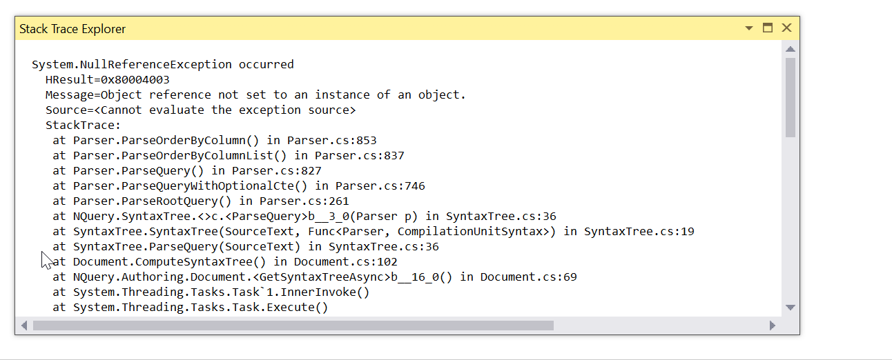

# Stack Trace Explorer

Stack Trace Explorer is a Visual Studio plug-in that pretty prints a stack trace
by turning types, methods, and paths into hyper links:

## Download

You can find the latest version in the [Visual Studio Marketplace](https://marketplace.visualstudio.com/items?itemName=ImmoLandwerthMSFT.StackTraceExplorer).

## Usage

Using it is super simple:

1. Copy a stack trace to the clipboard
2. Invoke <kbd>Ctrl</kbd> <kbd>Shift</kbd> <kbd>E</kbd>, <kbd>S</kbd>

Enjoy navigating your stack trace! 
